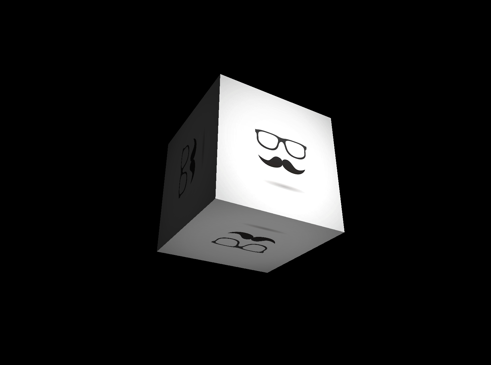

# in3D
A relatively simple Go powered OpenGL Graphics Engine

Create a new Window, Get OpenGL Context, Setup Camera Projection, create 3D object, Draw!  
Go Ahead, you can do it yourself... `go get github.com/seemywingz/in3D`
```go
package main

import (
	"github.com/seemywingz/in3D"
)

func main() {

	in3D.Init(800, 600, "Simple Cube in3D")
	in3D.NewLight().Position =
		in3D.Position{X: 10, Y: 1, Z: 10}

	in3D.SetRelPath("../assets/textures")
	texture := in3D.NewTexture("seemywingz.jpg")

	color := []float32{1, 1, 1}
	obj := in3D.NewPointsObject(
		in3D.NewPosition(0, 0, -7),
		in3D.Cube,
		texture,
		color,
		in3D.Shader["phong"],
	)
	obj.SceneLogic = func(s *in3D.SceneData) {
		s.XRotation++
		s.YRotation++
	}

	for !in3D.ShouldClose() {
		in3D.Update()
		obj.Draw()
		in3D.SwapBuffers()
	}
}

```

### ME-TODO:
  •  Optimize all the things!  
  •  Add Shadows, Ambient Occulsion and other light related things  
  • Have more fun making weird examples! 

### YOU-TODO:
Checkout the other examples to see some more basic functionality

##### Note:
###### Some Names and method may change until version 1.0 is tagged
###### Also, texture UVs are, for some reason, imported upside down. ( flip your texture vertiacally to render correctly  )

